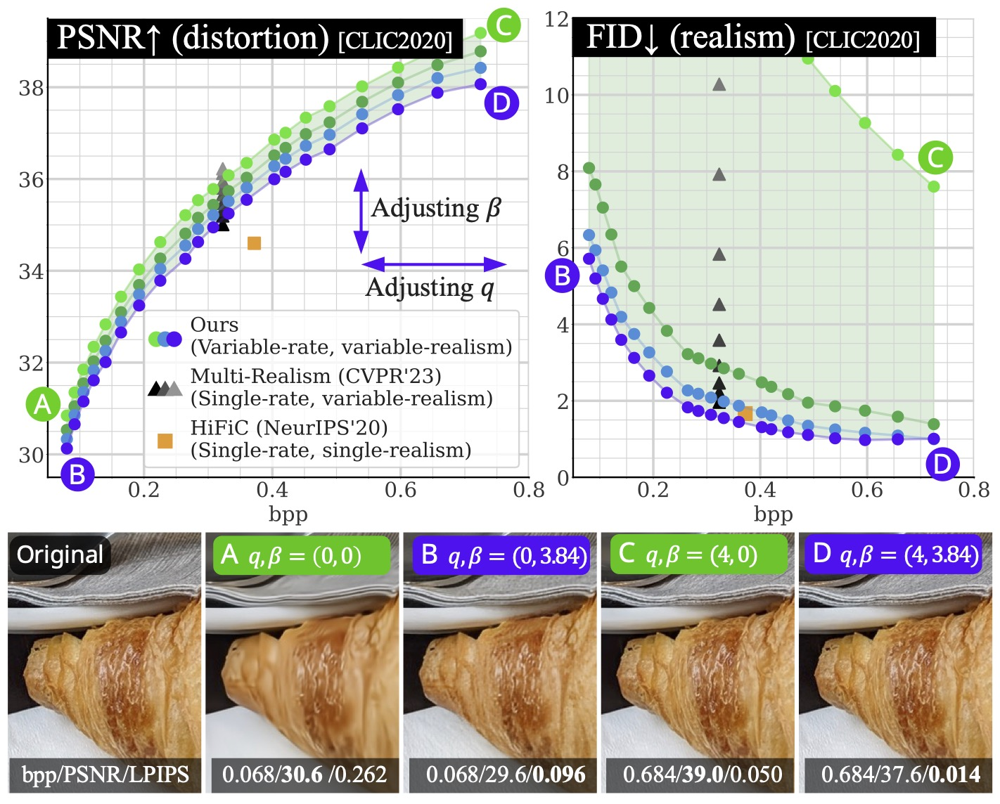

# Controlling Rate, Distortion, and Realism: Towards a Single Comprehensive Neural Image Compression Model [WACV2024]

This is the official PyTorch implementation of  
["Controlling Rate, Distortion, and Realism: Towards a Single Comprehensive Neural Image Compression Model (WACV2024, Oral)"](https://arxiv.org/abs/2405.16817).  
[Shoma Iwai](https://iwa-shi.github.io/), [Tomo Miyazaki](https://tomomiyazaki.github.io/), and [Shinichiro Omachi](http://www.iic.ecei.tohoku.ac.jp/~machi/index-e.html)


We have proposed a _single image compression model_ that can control bitrate, distortion, and realism.
As shown below, our method can cover a wide range of rate-distortion-realism points within a single model.
Please refer to our [paper](https://arxiv.org/abs/2405.16817) for more details.



## News

#### - 2024/6/20: Training code, instructions, reproduced training log, and pre-trained stage-2 model are released! See [training.md](./docs/training.md).
#### - 2024/5/27: Repository opened.

## Installation
#### 0. Install [poetry](https://python-poetry.org/).
```
curl -sSL https://install.python-poetry.org | python3 -
```
We used `poetry==1.6.1`.

#### 1. Clone this repository
```
https://github.com/iwa-shi/CRDR.git
```

#### 2. Install dependencies using poetry.
```
poetry install
```

#### *Dependencies
```
PyTorch 1.12.1
CUDA 11.3
CompressAI 1.2.4
```
Other PyTorch/CUDA versions might work, but these are the environments that we tested.

## Quick Start
#### 1. Download the pre-trained model
You can download it from [GDrive](https://drive.google.com/file/d/1H6T9-k0RX5SXk0VljHNiXUGXZrZl2seb/view?usp=drive_link) manually or use the following command:
```
curl "https://drive.usercontent.google.com/download?id=1H6T9-k0RX5SXk0VljHNiXUGXZrZl2seb&confirm=xxx" -o crdr.pth.tar
```

#### 2. Run `compress.py`
You can run a quick test on the images in `./demo_images` (three images from [Kodak dataset](https://r0k.us/graphics/kodak/)) using the following command:
```
poetry run python scripts/compress.py --config_path ./config/crdr.yaml --model_path ./crdr.pth.tar --img_dir ./demo_images --save_dir ./demo_results/crdr_q000_b384_kodak -q 0.00 -b 3.84 --decompress -d cuda
```
Binary compressed files (`kodimXXX.bin`), reconstructions (`kodimXXX.png`), `_bitrates.csv`, and `_avg_bitrate.json` will be stored in `./demo_results/crdr_q000_b384_kodak`.

The average bitrate should be `avg_bpp: 0.0641`. Please verify that the reconstructions look correct.


> [!NOTE]
> Currently, only single-GPU is supported. If you are using a multi-GPU machine, you can specify `CUDA_VISIBLE_DEVICES={DEVICE_ID}` to avoid unexpected behavior.

## Reproduce Results in the Paper
#### 1. Make Reconstructions

You can run the pre-trained model on your dataset, such as the CLIC2020 test dataset and Kodak dataset.

```
poetry run python scripts/compress.py --config_path ./config/crdr.yaml --model_path ./crdr.pth.tar --img_dir PATH/TO/DATASET --save_dir ./results/crdr_qXXX_bXXX_DATASET -q QUALITY -b BETA --decompress -d cuda
```
- `--quality` adjusts the bitrate. Float value from `0.0` to `4.0` in our pre-trained model. `0.0`: Low bitrate, `4.0`: High bitrate
- `--beta` adjusts realism. Float value from `0.0` to `5.12`. `0.0`: Low distortion, `5.12`: High realism

In Fig.5 in our paper, `--quality`: `{0.0, 0.25, 0.5, ..., 3.5, 3.75, 4.0}`, `--beta`: `{0.0, 3.84}` are used (`17*2=34` points in total).

For example,
```
poetry run python scripts/compress.py --config_path ./config/crdr.yaml --model_path ./crdr.pth.tar --img_dir ./datasets/CLIC/test --save_dir ./results/crdr_q150_b384_CLIC -q 1.5 -b 3.84 --decompress -d cuda
```

#### 2. Calculate Metrics

You can calculate metrics (PSNR, FID, LPIPS, DISTS) of the reconstructions by running the following script:
```
poetry run python scripts/calc_metrics.py --real_dir PATH/TO/DATASET --fake_dir PATH/TO/RECONSTRUCTIONS -d cuda
```
Results will be stored in `{fake_dir}/_metrics.json`.

For example,
```
poetry run python scripts/calc_metrics.py --real_dir ./datasets/CLIC/test --fake_dir ./results/crdr_q150_b384_CLIC -d cuda
```

You can find results on CLIC2020, Kodak, and DIV2K at [rd_results](./rd_results/).

## Training
See [./docs/training.md](./docs/training.md).

## TODO List
- [x] Release repository
- [x] Pre-trained model
- [x] Test code and instructions
- [x] Training code and instructions

## Citation
If you find this code useful for your research, please consider citing our paper:
```
@INPROCEEDINGS{iwai2024crdr,
  author={Iwai, Shoma and Miyazaki, Tomo and Omachi, Shinichiro},
  booktitle={2024 IEEE/CVF Winter Conference on Applications of Computer Vision (WACV)}, 
  title={Controlling Rate, Distortion, and Realism: Towards a Single Comprehensive Neural Image Compression Model}, 
  year={2024},
  volume={},
  number={},
  pages={2888-2897},
  doi={10.1109/WACV57701.2024.00288}}
```

## Acknowledgement
We thank the authors of the following repositories:
- [CompressAI](https://github.com/InterDigitalInc/CompressAI): For entropy_model.
- [ELIC (unofficial implementation by JiangWeibeta)](https://github.com/JiangWeibeta/ELIC)
- [HiFiC](https://github.com/tensorflow/compression/tree/master/models/hific)
- [HiFiC (unofficial PyTorch Implementation by Justin-Tan)](https://github.com/Justin-Tan/high-fidelity-generative-compression)
- [tensorflow-compression](https://github.com/tensorflow/compression/tree/master)
- [MMEngine](https://github.com/open-mmlab/mmengine/tree/main): For config and registry.

## Issues
If you have any questions or encounterd any issues, please feel free to open issue.